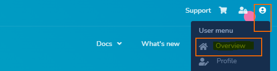
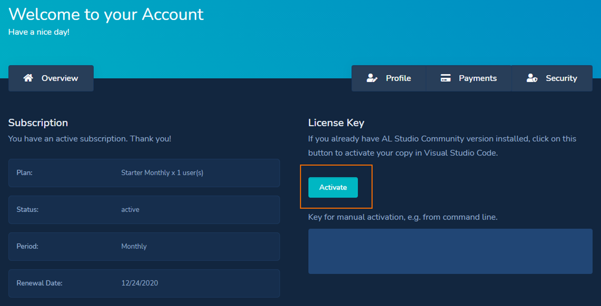
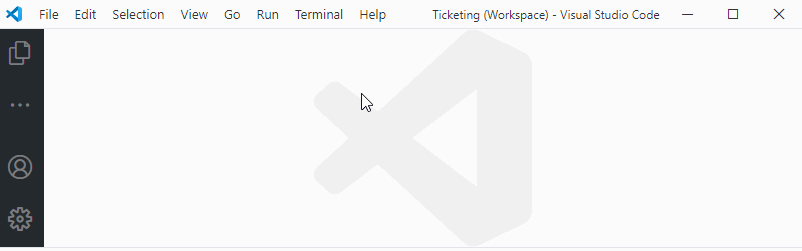

# Installation

AL Studio is a Visual Studio Code extension published on [Visual Studio Marketplace](https://marketplace.visualstudio.com/VSCode).

## Install from Marketplace

You can get the extension by searching for `dynasist.al-studio` on the Marketplace website or directly in VSCode / Extensions tab.

Direct link: [https://marketplace.visualstudio.com/items?itemName=dynasist.al-studio](https://marketplace.visualstudio.com/items?itemName=dynasist.al-studio)

Read more details in related [Visual Studio Code Documentation](https://code.visualstudio.com/docs/editor/extension-gallery#_browse-for-extensions).

## Manual installation from VSIX package

You can also install VSIX packages downloaded from the Marketplace or received from our team.

Read more details in related [Visual Studio Code Documentation](https://code.visualstudio.com/docs/editor/extension-gallery#_install-from-a-vsix).

## Activation

Activation is only required for Premium version. See [Licensing](./licensing.md) page for more details.

### Online Activation steps

1. Make sure you have AL Studio installed from the Marketplace: https://marketplace.visualstudio.com/items?itemName=dynasist.al-studio 
2. Go to https://www.al.studio/account page, where you will find an “Active” button. This will open VSCode and perform the activation automatically.

(this screenshot was taken from a test account)

### Manual Activation steps

1. Open VSCode
2. Open commands (Ctrl+Shift+P)
3. Search for “AL Studio: Activate” command and execute it
4. An input will appear where you need to paste in the above key
5. Hit Enter and a notification should appear on the bottom-right side.

## See Also

[Visual Studio Code Documentation - Extension Gallery](https://code.visualstudio.com/docs/editor/extension-gallery)

[Licensing](./licensing.md)